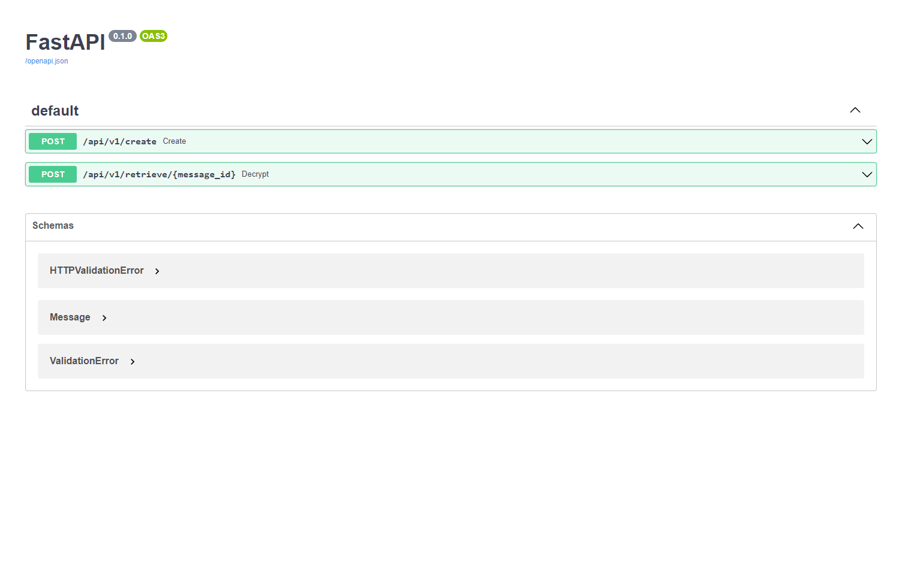

# Secret messages

An API to encrypt and send messages by id, once readed the message is delete.



## Run

```bash
uvicorn main:app --reload
```

## Documentation

Run the project and go to this url [http://localhost:8000/docs]
